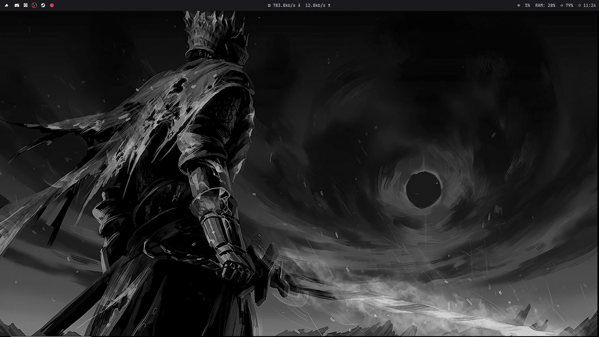

# Essential Packages and Graphics Tweaks Installer

## Overview
This repository contains a simple script for installing essential packages along with some graphics tweaks for your system.

## Installation Instructions
1. **Download** the entire repository and extract it into your home folder.
2. **Open a terminal** and navigate to the extracted folder.
3. **Run the installation script** using Python:
   ```bash
   python install_config.py
   ```
4. **Wait for the script to complete** and then restart your PC.

## Post-Reboot Configuration
- After rebooting, you may delete the default KDE bar if desired.
- **Import custom keybindings**:
  1. Open **KDE Settings Manager**.
  2. Import the `keybindings.src` shortcut file.
  3. You might need to manually add the **'foot' terminal** shortcut if an error occurs during the import.

## Sample Screenshot


